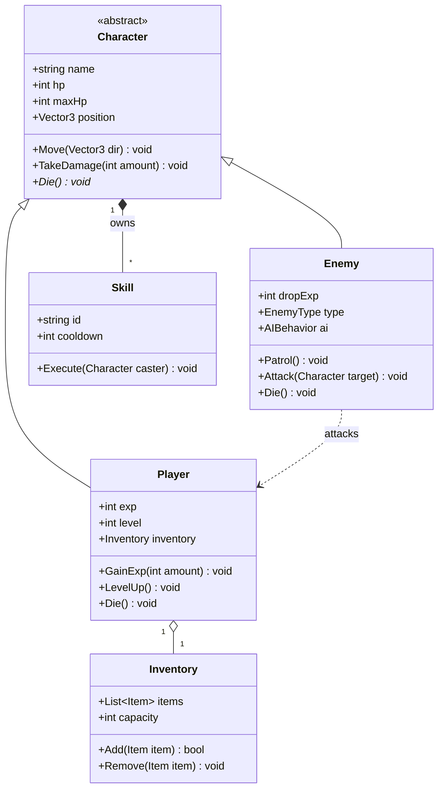
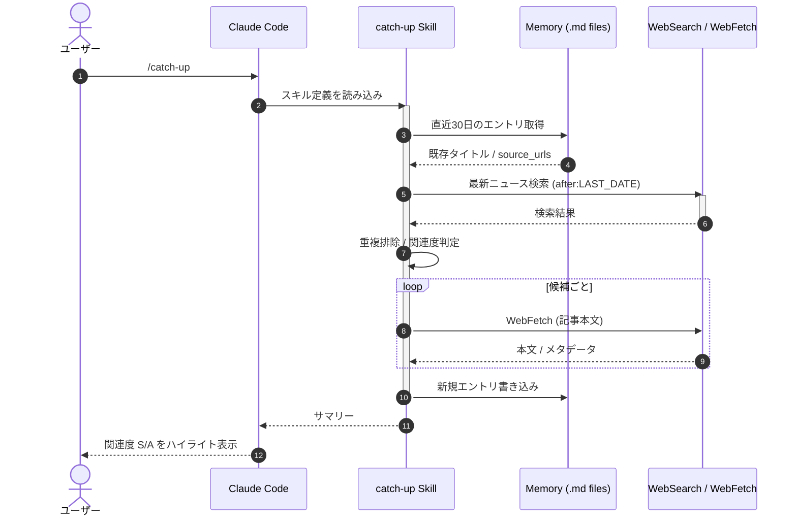

# Mermaid デモ — クラス図 / シーケンス図

> Markdown 版（HTML 版 `sample.html` との比較用）。Mermaid コードブロックは GitHub では標準でレンダリングされ、VSCode では Markdown Preview Mermaid Support 等の拡張で表示可能。

---

## 1. クラス図（題材: ゲーム開発のキャラクター階層）

Unity 風の Character 基底クラスを Player / Enemy が継承し、装備・スキルとの関連を持つ例。



<details>
<summary>Mermaid ソース（クラス図）</summary>

````
classDiagram
    class Character {
        <<abstract>>
        +string name
        +int hp
        +int maxHp
        +Vector3 position
        +Move(Vector3 dir) void
        +TakeDamage(int amount) void
        +Die()* void
    }
    class Player {
        +int exp
        +int level
        +Inventory inventory
        +GainExp(int amount) void
        +LevelUp() void
        +Die() void
    }
    class Enemy {
        +int dropExp
        +EnemyType type
        +AIBehavior ai
        +Patrol() void
        +Attack(Character target) void
        +Die() void
    }
    class Inventory {
        +List~Item~ items
        +int capacity
        +Add(Item item) bool
        +Remove(Item item) void
    }
    class Skill {
        +string id
        +int cooldown
        +Execute(Character caster) void
    }
    Character <|-- Player
    Character <|-- Enemy
    Player "1" o-- "1" Inventory
    Character "1" *-- "*" Skill : owns
    Enemy ..> Player : attacks
````

</details>

---

## 2. シーケンス図（題材: Claude Code の Skill 実行フロー）

ユーザーが `/catch-up` を実行したときの、Claude Code / Skill / MCP サーバ / Web のやり取りを模式化。



<details>
<summary>Mermaid ソース（シーケンス図）</summary>

````
sequenceDiagram
    autonumber
    actor User as ユーザー
    participant CC as Claude Code
    participant Skill as catch-up Skill
    participant Mem as Memory (.md files)
    participant Web as WebSearch / WebFetch

    User->>CC: /catch-up
    CC->>Skill: スキル定義を読み込み
    activate Skill
    Skill->>Mem: 直近30日のエントリ取得
    Mem-->>Skill: 既存タイトル / source_urls
    Skill->>Web: 最新ニュース検索 (after:LAST_DATE)
    activate Web
    Web-->>Skill: 検索結果
    deactivate Web
    Skill->>Skill: 重複排除 / 関連度判定
    loop 候補ごと
        Skill->>Web: WebFetch (記事本文)
        Web-->>Skill: 本文 / メタデータ
    end
    Skill->>Mem: 新規エントリ書き込み
    deactivate Skill
    Skill-->>CC: サマリー
    CC-->>User: 関連度 S/A をハイライト表示
````

</details>

---

## 確認方法

- **GitHub**: そのままリポジトリに push すれば Mermaid が自動レンダリングされる（ネイティブサポート）
- **VSCode Markdown Preview**: 標準では Mermaid を描画しない。以下いずれかの拡張を入れる
  - `Markdown Preview Mermaid Support` (bierner)
  - `Markdown All in One`
- **ショートカット**: `Ctrl+Shift+V` で Preview パネル表示

## HTML 版との比較メモ

| 観点 | HTML (`sample.html`) | Markdown (`sample.md`) |
|---|---|---|
| エスケープ | `<<abstract>>` `<|--` は `&lt;` にエスケープ必須 | 不要（コードブロック内は素のテキスト扱い） |
| ダークテーマ | CSS で完全制御可能 | Preview 側のテーマに依存 |
| Mermaid 描画 | CDN スクリプトを `<script type="module">` で読込 | GitHub ネイティブ / VSCode 拡張に依存 |
| 配布性 | ブラウザに開けば誰でも見られる | レンダリング環境を選ぶ |
| 編集容易性 | タグ多くて手書きはやや重い | 軽量、Claude Code の編集も素直 |
| 差分レビュー | diff が読みにくい | diff がそのまま意味を持つ |
